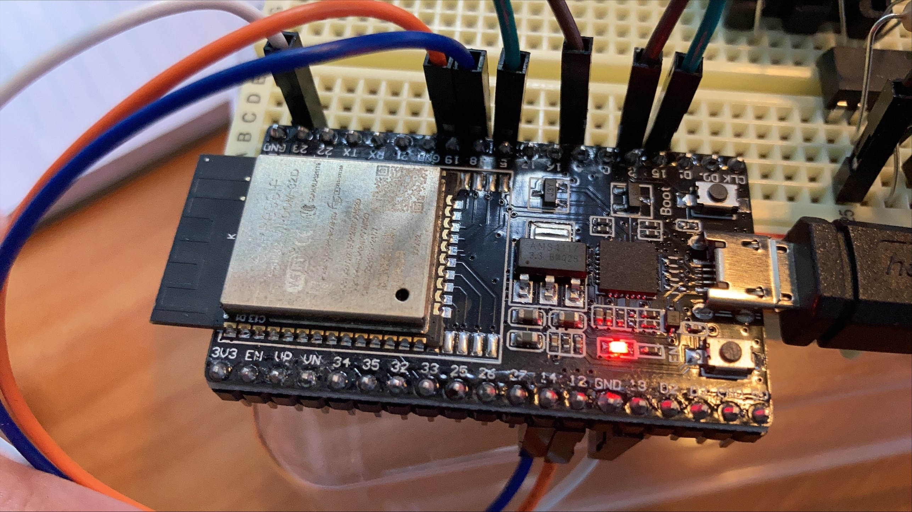

Master SPI - część projektu na przedmiot SKMwMSW
========================
Projekt zakłada stworzenie programowe interfejsu odbiornika w standardzie SPI na urzędzeniu ESP-32.

Opis działania
========================
Projekt przewiduje komunikację na migistrali SPI w trybie full-duplex (komunikacja w obie strony) na jednym urządzeniu. Do realizacji tego zadania wykorzystane zostały dwa interfejsy SPI dostępne na platformie ESP-32, tj. SPI3 (VSPI), SPI2 (HSPI).

Układ VSPI pełni rolę mastera w procesie komunikacji.
Układ HSPI pełni rolę slave'a w procesie komunikacji.

Sygnalizacja rozpoczęcia transmisji odbywa się za pośrednictwem dwóch portów GPIO należących do jednej ze stron komunikacji (mastera lub slave'a).

Oba interfejsy SPI mają zdefiniowany swój własny kanał DMA.

Dane odebrane przez slave'a są następnie wyświetlane na stronie dostępnej z serwera HTTP, któy jest uruchomiony jest na ESP-32. Dostęp odbywa się po zalogowaniu do sieci WiFi, do której podłączony jest serwer (moduł ESP-32). Strona dostępna jest pod adresem '''https://192.168.1.102''', należy jednak pamiętać, że adres IP serwera w adresie strony może się różnić. 

(INFO: DO POPRAWY)
Z uwagi na często występujący błąd wielkości nagłówka pakietu dla urządzeń stacjonarnych, zaleca się uruchamianie strony wyłącznie na urządzeniach mobilnych.

Ważne uwagi
========================
Przed skompilowaniem należy wypełnić pola z danymi dostępowymi do sieci WiFi. Znajdują się one w pliku "sdkconfig".

```
CONFIG_EXAMPLE_WIFI_SSID="xxxxxx"
CONFIG_EXAMPLE_WIFI_PASSWORD="xxxxxxx"
````

Sposób podłączenia pinów
========================

Na przykładzie modelu ESP-32-WROOM-32D.


|           |
|-----------|
|13 <---> 23|
|12 <---> 19|
|14 <---> 18|
|2  <---> 4 | 
|15 <---> 5 |


|Pin        |Port           |Funkcja                                    |
|-----------|---------------|-------------------------------------------|
|23         |VSPID          |(master) Master Out, Slave In              |
|19         |VSPIQ          |(master) Master In, Slave Out              |
|18         |VSPICLK        |(master) Linia zegarowa                    |
|5          |VSPICS0        |(master) Chip Select                       |
|4          |GPIO4          |(master) GPIO do rozpoczęcia transmisji    |
|2          |GPIO2          |(slave)  GPIO do rozpoczęcia transmisji    |
|15         |HSPICS0        |(slave)  Chip Select                       |
|14         |HSPICLK        |(slave)  linia zegarowa                    |
|12         |HSPIQ          |(slave)  Master In, Slave Out              |
|13         |HSPID          |(slave)  Master Out, Slave In              |

Inne elementy składowe systemu
========================

(STM32) Odbiór danych z czujnika pola magnetycznego i przesyłanie ich przez interfejs SPI: 
Repozytorium projektu: https://github.com/Phyteon/STM32_Comm
